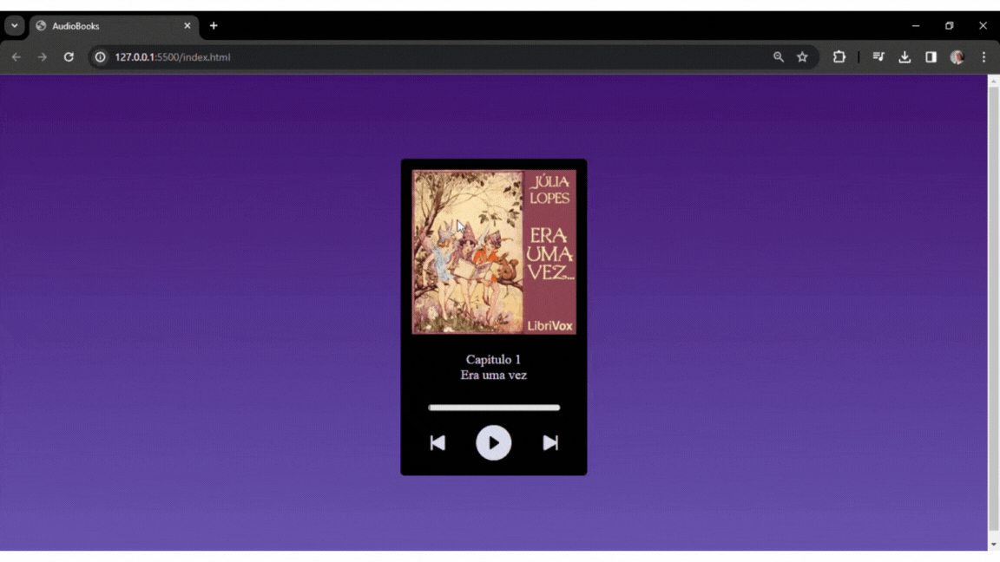

# AudioBook

Este é um projeto de Audiobook desenvolvido durante o evento de Intensivão de Javascript da [Hashtag](https://www.hashtagtreinamentos.com/). Desenvolvido com tecnologias HTML, CSS, JavaScript, nosso objetivo era criar uma  plataforma interativa para ouvir Audiobooks, de forma a permitir que os usuários explorem uma diversificada seleção de áudios, desfrutando das narrativas sem a necessidade de leitura convencional.

## Tecnologias Utilizadas:

* [HTML](https://developer.mozilla.org/pt-BR/docs/Web/HTML): Linguagem de marcação para criação de páginas web
* [CSS](https://developer.mozilla.org/pt-BR/docs/Web/CSS): Linguagem de estilo para design de páginas web
* [JavaScript](https://developer.mozilla.org/pt-BR/docs/Web/JavaScript): Linguagem de programação para tornar páginas web interativas


## Imagens:

<div align="center">
  <p>Demonstração</p>
  
</div>


## Como utilizar

1. Clone o repositório:

   ```terminal
   git clone https://github.com/RicardoUbi/Front-End - Collection.git

2. Execute o programa
   * Para hospedagem utilizei a extensão do vscode (Live server), Inicie ela, e tudo rodara na web.

### Divirta-se!
   