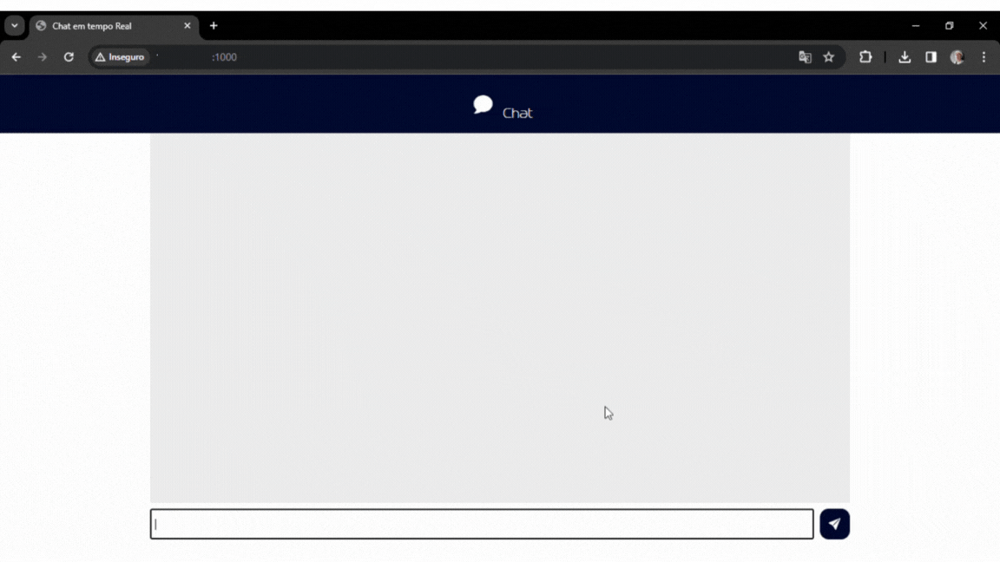

# Chat Online

Este é um projeto de Página de Apple Watch desenvolvido durante o evento de Intensivão de Javascript da [Hashtag](https://www.hashtagtreinamentos.com/). O desenvolvimento abrange desde a configuração do frontend até a criação do servidor backend utilizando Node.js e Socket.io para possibilitar a comunicação instantânea entre os usuários. Resultando em uma plataforma com experiência dinâmica e interativa para os usuários se conectarem em tempo real.

## Tecnologias Utilizadas:

* [HTML](https://developer.mozilla.org/pt-BR/docs/Web/HTML): Linguagem de marcação para criação de páginas web
* [CSS](https://developer.mozilla.org/pt-BR/docs/Web/CSS): Linguagem de estilo para design de páginas web
* [JavaScript](https://developer.mozilla.org/pt-BR/docs/Web/JavaScript): Linguagem de programação para tornar páginas web interativas
* [Node.js](https://nodejs.org/): Ambiente de execução JavaScript do lado do servidor
* [socket.io](https://socket.io/): Biblioteca JavaScript para comunicação em tempo real via WebSocket


## Imagens:

<div align="center">
  <p>Demonstração</p>
  
</div>


## Como utilizar

1. Clone o repositório:

   ```terminal
   git clone https://github.com/RicardoUbi/FrontEnd-Collection.git
   cd Chat

2. Instale as bibliotecas

    ```terminal
    npm install express 
    npm install socket.io
    ```


3. Execute o programa

   ```terminal
   node --watch ./servidor.js

### Divirta-se!
   