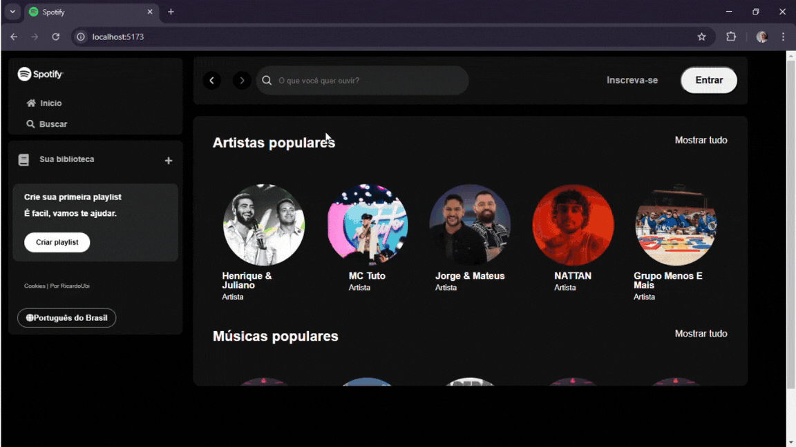

# Spotify Study

Bem-vindo, este é um projeto de estudo do spotify, usei como referencia os eventos "Imersão Front-End" da Alura e "Jornada Full Stack" da Hashtag.

## Tecnologias Utilizadas
- **Front-end:** React, Vite, Axios, TailwindCSS
- **Back-end:** Node.js, Express, MongoDB

## Funcionalidades
- Buscar artistas por nome
- Exibir informações do artista
- Listar músicas associadas ao artista
- Exibição dinâmica de dados com React
- Player de música

## Usabilidade

<div align="center">
  
</div>

## Inicialização do Projeto
Para rodar o projeto localmente, é necessário iniciar o **back-end** e o **front-end** separadamente.

### Estrutura do Projeto
```
📦 music-explorer
├── 📂 back-end      # Código do servidor 
├── 📂 front-end     # Aplicação React
└── 📜 README.md     # Documentação do projeto
```

### Passo a Passo
1. **Clone o repositório e entre na branch correta:**
   ```sh
   git clone <URL_DO_REPOSITORIO>
   git checkout <NOME_DA_BRANCH>
   ```

2. **Inicie o Back-end**
   Abra um terminal e execute os seguintes comandos:
   ```sh
   cd back-end
   npm install
   npm start
   ```

3. **Inicie o Front-end**
   Em outro terminal, execute:
   ```sh
   cd front-end
   npm install 
   npm run dev
   ```
### Passo a Passo - Demonstração

<div align="center">
  
</div>

O front-end estará disponível em `http://localhost:5173` (ou outra porta que o Vite indicar), e o back-end rodará na `http://localhost:3001`.

### Divirta-se!

---
Desenvolvido com ❤️ por RicardoUbi.

