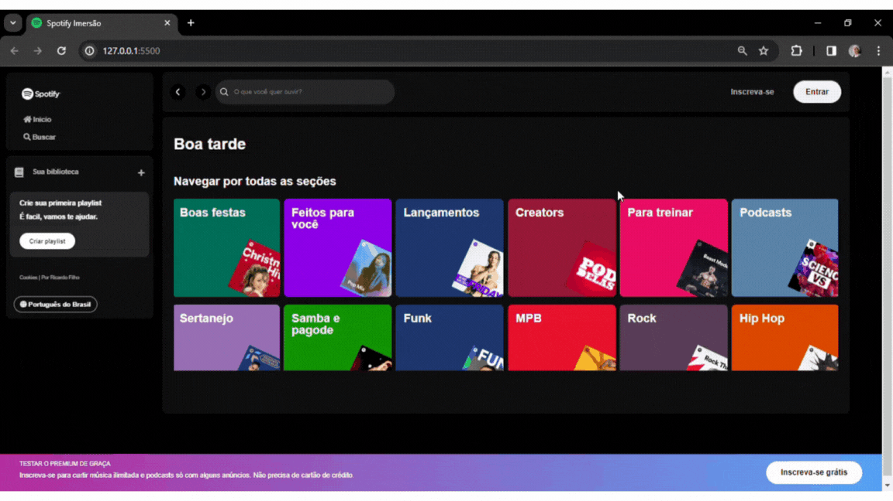

# Spotify - Imersão Front-End da Alura

Este é um projeto de Clone do [Spotify](https://open.spotify.com/intl-pt) desenvolvido durante o evento de Imersão Front-End da [Alura](https://www.alura.com.br/). Desenvolvido com tecnologias HTML, CSS, JavaScript e um pouco de Node.js, nosso objetivo era criar uma réplica autêntica do Spotify. Proporcionando aos usuários uma experiência idêntica à que teriam ao visitar a página oficial, com recursos de pesquisa e elementos visuais idênticos aos originais.

Este projeto é uma oportunidade para explorar e aprimorar habilidades no desenvolvimento web, abrangendo desde a estruturação da interface até a implementação de funcionalidades interativas.

## Tecnologias Utilizadas:

* [HTML](https://developer.mozilla.org/pt-BR/docs/Web/HTML): Linguagem de marcação para criação de páginas web
* [CSS](https://developer.mozilla.org/pt-BR/docs/Web/CSS): Linguagem de estilo para design de páginas web
* [JavaScript](https://developer.mozilla.org/pt-BR/docs/Web/JavaScript): Linguagem de programação para tornar páginas web interativas
* [Node.js](https://nodejs.org/): Ambiente de execução para JavaScript do lado do servidor


## Imagens:

<div align="center">
  <p>Demonstração</p>
  
</div>


## Como utilizar

1. Clone o repositório:

   ```terminal
   git clone https://github.com/RicardoUbi/Spotify-Alura.git

2. Instale as bibliotecas:
   
   ```terminal
    npm install -g json-server
    json-server --watch api-artists/artists.json --port 3000

3. Execute o programa
   * Para hospedagem utilizei a extensão do vscode (Live server), Inicie ela, e tudo rodara na web.

### Divirta-se!
   
